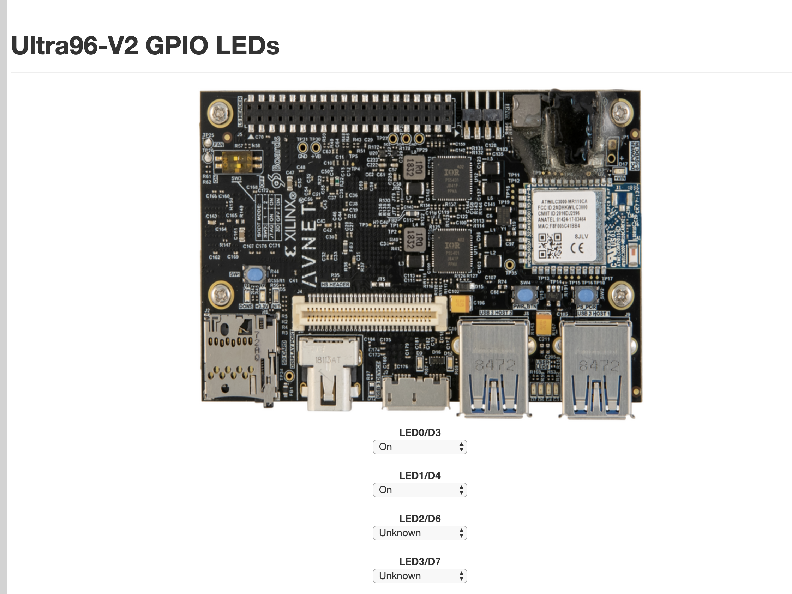
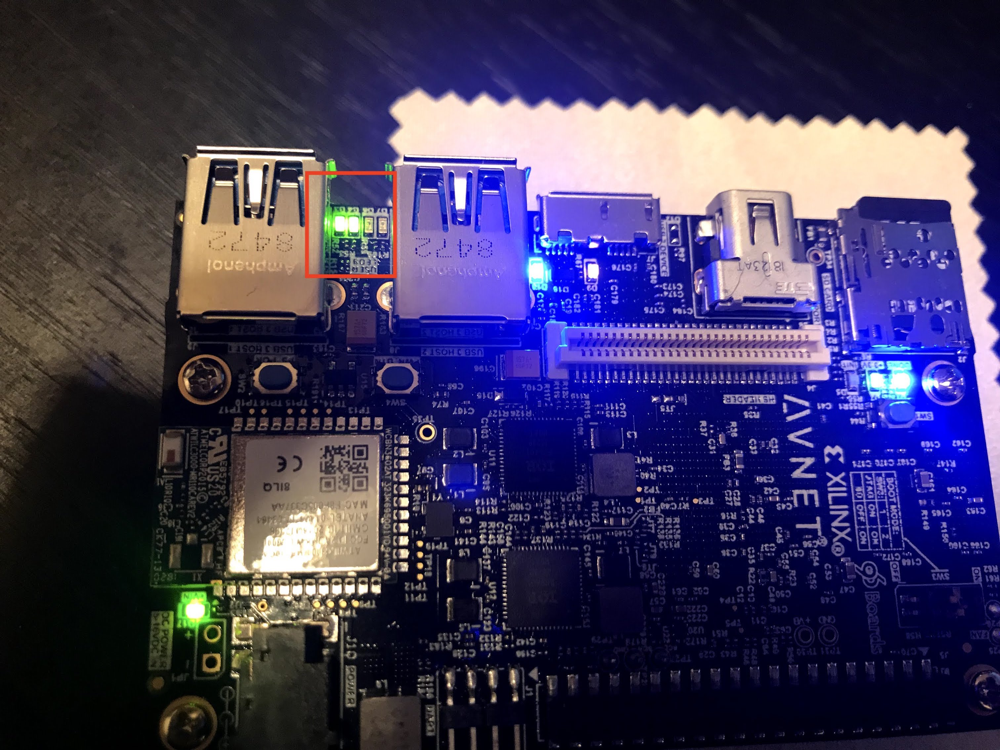

# Ultra96について

* Avnet（アヴネット）社が出してるFPGAボード
* 3万円くらい
* Armコア内蔵のFPGAのことをSoCと呼ぶ
* ラズパイと同じくらいの大きさ
* 開発にはvivado（ヴィヴァド）というIDEと使う（Windows, Linuxのみ対応）


# チュートリアル的なもの

## とりあえず起動

1. 付属のmicro SDカードを入れる
2. 電源ケーブルをつなぐ（アダプタが必要）
3. SW4スイッチを押す
4. なんかLEDが光ってかっこよく起動する。ファンがすごい回りだす。
5. 停止はSW4スイッチを長押し（10秒くらい長押し。指が痛い）


## とりあえずLチカ

### チュートリアルイメージ（Lチカ）を焼く

[ここ](https://thefuturestillremains.com/2019/08/30/avnet-ultra96-v2-%e3%81%a7%e9%81%8a%e3%81%b6-mac-%e3%81%a7l%e3%83%81%e3%82%ab%e3%81%be%e3%81%a7%e8%a1%8c%e3%81%84%e3%81%be%e3%81%97%e3%81%9f/)を参考に、LEDをチカチカさせる。

1. SDカードに焼くイメージを[ダウンロード](http://avnet.me/ultra96-v2-oob)
2. ↑のサイトではbalenaEtcherを使っているが、普通に `dd` コマンドでいい  

```
$ diskutil list
....略

/dev/disk5 (internal, physical):
   #:                       TYPE NAME                    SIZE       IDENTIFIER
   0:     FDisk_partition_scheme                        *16.0 GB    disk5
   1:             Windows_FAT_32 NO NAME                 16.0 GB    disk5s1
 
$ diskutil unmountDisk /dev/disk5

$ sudo dd bs=1m if=ultra96v2_oob_2018_3_190917_8GB.img of=/dev/rdisk5
```

豆知識：`dd` コマンドを使うときはrdiskというデバイス名のほうが高速  
参考： [diskとrdisk](https://www.junk-works.science/disk-and-rdisk/)


### 接続

まずは↑のサイト通りに実施。

1. Ultra96 - JTAG - micro USB - PCでつなぐ。
2. Ultra96の `SW4` スイッチを押して起動
3. Macのterminalで以下のように出るはず。  

```
$ ls -l /dev/tty.*
crw-rw-rw-  1 root  wheel   18,   4  8 13 18:08 /dev/tty.Bluetooth-Incoming-Port
crw-rw-rw-  1 root  wheel   18,   2  8 13 18:08 /dev/tty.MALS
crw-rw-rw-  1 root  wheel   18,   0  8 13 18:08 /dev/tty.SOC
crw-rw-rw-  1 root  wheel   18,  10  8 20 19:30 /dev/tty.usbserial-1234_oj10
crw-rw-rw-  1 root  wheel   18,  12  8 20 19:30 /dev/tty.usbserial-1234_oj11
```

出ない。私はこういうときにネット上の情報通りに上手くいった試しがない。

WiFi接続を試してみる。（Ultra96がWiFiのアクセスポイントになるので、そこにつなぎに行く）

1. `Ultra96_MACアドレス` というSSIDを探す。普通に見つかる。接続する。
2. `ssh root@192.168.2.1` を実行。パスワードは `root` 。入れた。


### Lチカ実施

1. ブラウザで `192.168.2.1` に接続。
2. `Ultra96-V2 GPIO LEDs` へ。
   
3. LEDのプルダウンを選択するとLチカできる。

どこがLチカなっているか分かりづらいが、下記の赤線枠部分がそれにあたる。

画像は `LED0/D3` と `LED1/D4`をOnにしている。




