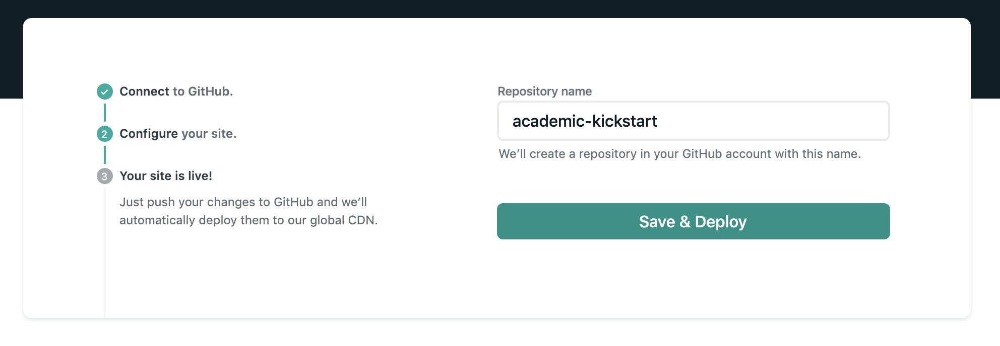

# 欲しい物

* ブログ
* podcastの一覧
  + 配信はanchor.fmでやってリンクを埋め込む
* ポートフォリオ（optional）


上記の通りで、かつ静的サイトジェネレータを使ってみたかった。
色々事前に調べた結果、以下の構成が楽そうだったので採用することにした。

* Hugo
  * academicテーマを利用
* Netlify
* 静的ページ生成元のソースコードはGitHubで管理

[ここ](https://marumalog.hatenablog.jp/entry/2018/08/20/222601)を参考にした。


# Hugo


## インストール

Macでのinstall方法。  
[公式のQuick Start](https://gohugo.io/getting-started/quick-start/)参照。

```sh
$ brew install hugo
```

## テーマ

テーマは評判の良い[Academic](https://themes.gohugo.io/academic/)にしてみる。  
基本はポートフォリオ用のテーマ。  
ブログだけじゃなくて、色々コンテンツ置けそうという理由。


# Netlify

## Academicテーマのセットアップ

Netlifyを使うとAcademicのデプロイが超絶楽ちん。  
具体的には、Netlifyのページ上だけでデプロイが完了する。  
[Academic公式も推奨している](https://github.com/gcushen/hugo-academic#install-with-web-browser)ので、このやり方でいく。

1. [NetlifyにAcademicをデプロイするページ](https://app.netlify.com/start/deploy?repository=https://github.com/sourcethemes/academic-kickstart)へ移動して「Connect to GutHub」をクリック。
  GitHubでの認証を承認する。

  

2. 「Repository name」にGitHubに登録したいリポジトリ名を入力。  
  ここで入力した名前で新規リポジトリが作成され、[academic-kickstart](https://github.com/sourcethemes/academic-kickstart)がforkされる様子。  
  さらに勝手にNetlifyと連携してくれる。（細かいところが気になるが、先に進む）  
  自分は `portfolio` というリポジトリ名にした。

  

3. 下記のようになったら、もうAcademicのデフォルト状態でデプロイされている。  
  黒く塗りつぶしている箇所にリンクがあり、そこからアクセスできるはず。

  


リンクをクリックして、下記が閲覧できればOK。楽すぎる。


## Academic内のコンテンツを編集

自分のGitHubに追加されたリポジトリ（自分は `portfolio` というリポジトリ名にした）をclone。

```sh
$ git clone https://github.com/[ユーザ名]/portfolio.git
```

試しにAcademicのトップに表示されているAuthorの名前を変えてみる。

`content/authors/admin/_index.md` の中にある  
```
# Display name
title: Nelson Bighetti
```
のところを
```
# Display name
title: Test
```
に変える。

この変更をGitHubのmasterにpushし、しばらく経つとNetlifyに自動で反映される。  
楽すぎる...


